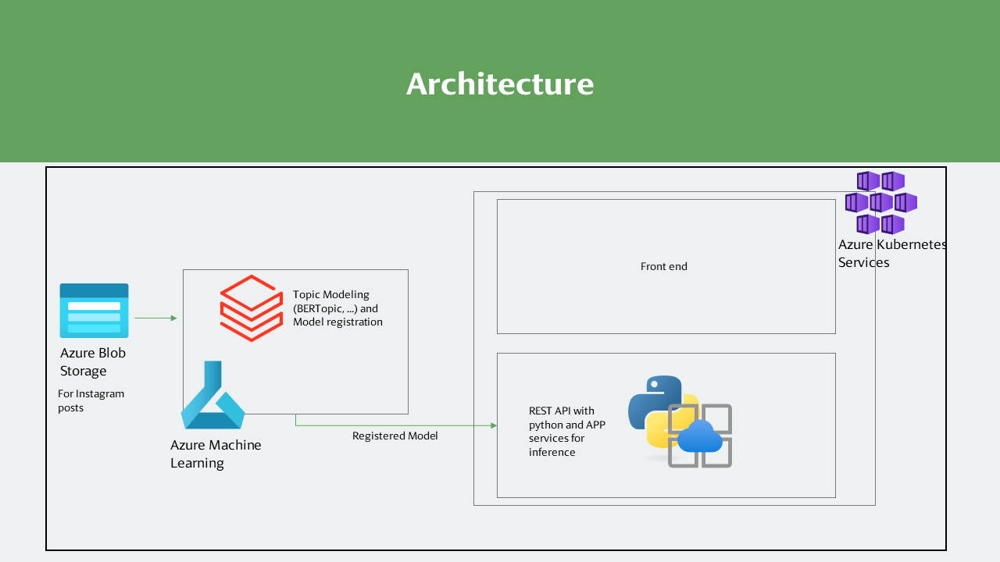

# AI Challenge

## Usecase

Topic modeling for instagram posts and model end point as microservice on azure

### Topic modeling
To get the topics for more than 500 billion posts following steps can be done:
- Topic modeling using BERTopic or other methods like Top2Vec
- After getting topics using one of the above unsupervised method, a loop can be done to improve the topics, get the hierarchy and number of topics
- Using this semi supervised approach to get the topics and train the models, after that the model can be deployed to be used in a REST API

### REST-API end point on Azure using services like Azure kubernetes services and app services

